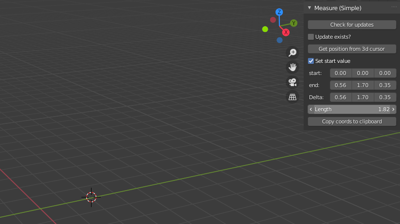

# blender_addons

Experiments with blender addons

## Goals
* Get to know the blender api by creating a "bare minimum" addon
* Create a demo addon that checks for updates and allow the user to update the addon using a single click.



For local development of blender addons, I recommend installing the `fake-bpy-module` from https://github.com/nutti/fake-bpy-module using

```
pip install fake-bpy-module-2.91
```

## Remaining work
* Currently the user needs to restart Blender for (at least) the GUI portion of the addon to be updated. Ideally some 
kind of "reload" functionality would be great. But in case there are modules\dependencies that needs a full restart of 
  blender this might as well be the "correct way" of implementing it. 
  
  