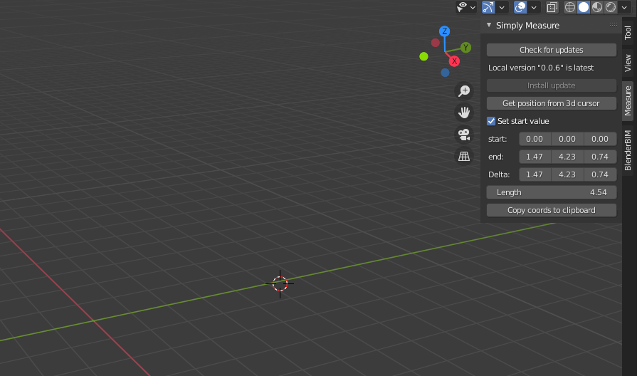

# blender_addons

Experiments with blender addons and self updating methods using github actions

The goal is to have the addon check for updates and allow the user to update the addon using a single click.
Currently the addon 



For local development of blender addons, I recommend installing the `fake-bpy-module` from https://github.com/nutti/fake-bpy-module using

```
pip install fake-bpy-module-2.91
```

